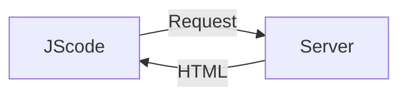

# React

> **React is a JavaScript library for building user interfaces.**

Mobile apps and desktop apps feel very **Reactive**: things happen instantly, you don't wait for new pages to load or actions to start.

Traditionally, in web apps, you click a link and wait for a new page to load. You click a button and wait for some action to complete.

### JScode (Client side JS page)
JavaScript runs in the browser - on the loaded page

You can manipulate the HTML structure (DOM) of the page.

We don't need to request a new HTML page using JavaScript itself because we can present(manipulating DOM) something different to user.

React does the same thing.

## Index

|  Title |
|--------------------------------------------|
| [1. React Basics & Working with Components](./ReadMeDocumentation/1.%20React%20Basics%20%26%20Working%20with%20Components.md) | 