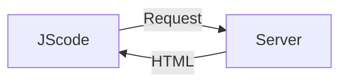

# React

> **React is a JavaScript library for building user interfaces.**

Mobile apps and desktop apps feel very **Reactive**: things happen instantly, you don't wait for new pages to load or actions to start.

Traditionally, in web apps, you click a link and wait for a new page to load. You click a button and wait for some action to complete.

### JScode (Client side JS page)
JavaScript runs in the browser - on the loaded page

You can manipulate the HTML structure (DOM) of the page.

We don't need to request a new HTML page using JavaScript itself because we can present(manipulating DOM) something different to user.

React does the same thing.

## Index

| Sr | Title |
|--|--------------------------------------------|
| 1. | [ React Basics & Working with Components](./ReadMeDocumentation/1.%20React%20Basics%20%26%20Working%20with%20Components.md) | 
| 2. | [ React State & Working with Events](./ReadMeDocumentation/2.%20React%20State%20%26%20Working%20with%20Events.md) |
| 3. | [ Rendering Lists & Conditional Content](./ReadMeDocumentation/3.%20Rendering%20Lists%20%26%20Conditional%20Content.md) |
| 4. | [ Styling React Components](./ReadMeDocumentation/4.%20Styling%20React%20Components.md) |
| 5. | [ Debugging React Apps](./ReadMeDocumentation/5.%20Debugging%20React%20Apps.md) |
| 6. | [ Working with Fragments, Portals & Refs](./ReadMeDocumentation/6.%20Working%20with%20Fragments%2C%20Portals%20%26%20Refs.md) |
| 7. | [ Handling Side Effects ](./ReadMeDocumentation/7.%20Handing%20Side%20Effects%2C%20Using%20Reducers%20%26%20Using%20Cotext%20API.md) |
| 8. | [ Using useReducers ](./ReadMeDocumentation/8.%20Using%20Reducers.md) |
| 9. | [ Context ](./ReadMeDocumentation/9.%20React%20Context.md) |
| 10. | [ Rules of Hooks ](./ReadMeDocumentation/10.%20Rules%20of%20Hooks.md) |
| 11. | [ How React Works ](./ReadMeDocumentation/11.%20Behind%20the%20Scenes.md) |
| 12. | [ Preventing unnessary re-evaluations (React.memo()) ](./ReadMeDocumentation/12.%20Preventing%20unnessary%20re-evaluations.md) |
| 13. | [ Memoizing by useMemo() ](./ReadMeDocumentation/13.%20Memoizing%20by%20useMemo().md) |
