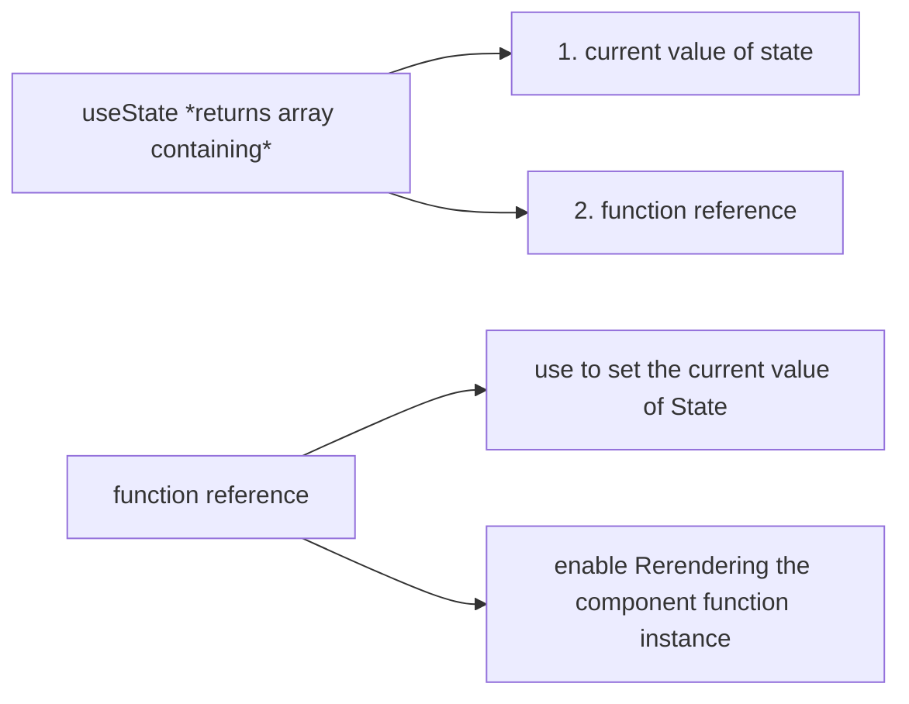
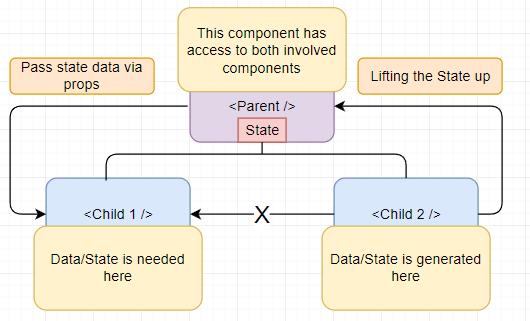

User Interaction & State
Making Apps Interactive & Reactive


#  Listening to Events & Working with EventHandlers

In all built in HTML elements (such as div, h2, button), we have full access to native DOM events which we can listen to. (eg. click, blur, ...)

Reference: https://developer.mozilla.org/en-US/docs/Web/API/Element#events

> For all these default events there is prop equivalent in React which we can add to these built-in HTML elements to listen to these events

With JavaScript we add event listener like this :
```js
// imperative way to add event listener

document.getElementById('some_id').addEventListener();
```

>React expose all these default events as props which start with **on** word.

> All these props(starting with on), want a function as value and that function will execute when that event occurs.

```jsx
// adding events: functionRef will be executed when button is clicked

const SomeComp = () => {
    let title = 'Reacting to Events';
    const clickHandler = (event) => {
        console.log("event:", event);
    }
    return (
        <div>{title}</div>
        <button onClick={clickHandler}> Click Me </button>
    );
}
```
> We attached only reference of function (clickHandler without () in button prop onClick value) to onClick event. If we put function call there to prop value that function will be executed on page load also.


# How Component Functions Are Executed

After reacting to event now question arise, How can we now change what shows up on the screen.

suppose we want to change the title on click of a button.

Intuition : *we should change the value of title variable inside clickHandler function.*

```jsx
// React does not work like this...
// Wrong code of updating variable's value in the view

const SomeComp = () => {
    let title = 'Reacting to Events';
    const clickHandler = (event) => {
        console.log("event:", event);
        title = "updated!!"; // title variable value is changed, still this will not reflect in the view
    }
    return (
        <div>{title}</div>
        <button onClick={clickHandler}> Click Me </button>
    );
}
```
Though function will execute on click and if we put log for the variable value it will be updated value only, we will not see updated value in view.

Our React Component is function (**that returns JSX**), we have never called any component functions and we just use this functions like HTML elements in JSX code.

By using our components in JSX code, we make react aware of our component functions and whenever react evaluates this JSX code, it will call these component functions. (*and this functions also return some more JSX code(of its child components), this happens until there is no more JSX code to be evaluated*)

Its all started by the [index.js](./1.%20React%20Basics%20%26%20Working%20with%20Components.md#analyzing-a-standard-react-project) file where we initially point at App component.

Problem is React will go through this component functions only when the application is initially rendered, So we need a way to call a component function to change the values in the view.


# Working with "State"

## useState
useState is function (also **React hook**) from react library and it allow us to **define values as state** where changes to these values should reflect in the component function being called again.

> All the hooks in React start with **use** word, And they must be called inside of React component functions. (they can't be called outside of the React functions and also should not be called in any nested functions(for nested function there is one exception))

### How to use useState function
Inside of the component function we just need to call useState();
useState() creates a special kind of variable where changes will lead component functions to be called again. we can initialize the state value by passing value into useState(value) function. 

To use the variable, useState() return the value of the current state along with one function (which passes as value), the function is used to modify the value of the variable(state value).


```jsx
// Example of State

import { useState } from react;

const SomeComp = () => {
    
    const [title, setTitle] = useState('Reacting to Events'); // using array destructuring we define const title variable and setTitle function

    const clickHandler = (event) => {
        console.log("event:", event);
        setTitle('updated!!'); // This function updates the current state value and 
        //it is responsible for calling the current component function (SomeComp) again to rerender.
    }
    return (
        <div>{title}</div>
        <button onClick={clickHandler}> Click Me </button>
    );
}

```



> **Note:**<br>
    if we log the value of title inside clickHandler, we will get old value only because calling the state-updating function actually **doesn't change the value right away** but instead **schedule the state update.** so the updated value may not available yet in clickHandler. But in the view eventually we will see the updated value.


If we have multiple instance of function components (eg. ```<SomeComp />``` is used more than places), on Click, only that instance which is being clicked, will be called again (to rerender).

>  When the component function is executed second time, it will update the function **const variable title** (we will never reassign value to this variable, only through setTitle the value will be updated).`

That **does not mean** second time we will **override the const title** with 'Reacting to Events'<br>
>    React keeps track of when we call useState in a given component instance for the first time and when we call it for the first time ever, it will take that argument as an initial value but if a component is then re-executed because of a state change, React will not reinitialize the state instead it will detect that this State had been initialized in the past and it will just grab latest State and return that State value.


# Listening to User Input
We can get the value of input by adding events (*onClick, onChange, onInput, etc...*) and when that event occurs we will get an event object which describes the occurred event.

```jsx
// onChange event for capturing value of input at each change.

const SomeComp = () => {
    const titleChangeHandler = (event) => {
        console.log("value of input:", event.target.value);
    }
    return (
        <form>
            <div>
                <label>Title</label>
                <input type='text' onChange={titleChangeHandler}>
            <div>
        </from>
    );
}
```

# Working with Multiple States

We can use State to hold the input values that user has entered in case if component function executes again (then local variables values will reset).

We can use more than one states in one component.

```jsx
// multiple states in one component

import {useState} from 'react';

const SomeComp = () => {
    const [title, setTitle] = useState(''); // initialize new state 1
    const [amount, setAmount] = useState(''); // initialize new state 2

    const titleChangeHandler = (event) => {
        console.log("value of Title:", event.target.value);
        setTitle(event.target.value); // store the current input value to state 1
    }
    const amountChangeHandler = (event) => {
        console.log("value of Amount:", event.target.value);
        setAmount(event.target.value); // store the current input value to state 2
    }
    return (
        <form>
            <div>
                <label>Title</label>
                <input type='text' onChange={titleChangeHandler}>
            <div>
            <div>
                <label>Amount</label>
                <input type='number' onChange={amountChangeHandler}>
            <div>
        </from>
    );
}
```

# Updating State that Depends on the Previous State

In previous example we can use only state (One object containing form values eg. {title: 'asdf', amount: '20'});

```jsx
// Example of using one state containing form input keys in one object.

const [formValue, setForm] = useState({title: '', amount: ''});
```

To set the value of State when change occurs, we need to get the previous state value and modify the value of input in which change is occurred.

```jsx
// Modify form (WRONG WAY), if title value is changed.

const titleChangeHandler = (event) => {
    setForm({...formValue, title: event.target.value});
}
```
In above code, we are depending on previous state value, to update the current state value.

> React schedules state update, it does not perform them instantly therefore theoretically if we schedule a lot of state updates at the same time, we could be depending on an outdated or incorrect state snapshot with above approach.

We have a way to always get correct previous state.

In setForm we can pass function and in parameter we can get previous state value.

```jsx
// Correct way to get previous state value.

const titleChangeHandler = (event) => {
    console.log("value", event.target.value);
    // setForm({...formValue, title: event.target.value}); // not correct way

    setForm((prevState)=> {
        return { ...prevState, title: event.target.value };
    })
};
```

# Form Submission

If a button with type submit is pressed inside of a form then form element will emit **submit event**. 

Now default browser behavior is on click of type submit button page will reload. To prevent that we can use preventDefault() of passed event object.


```jsx
// onSubmit event & Prevent refresh on submit

import {useState} from 'react';

const SomeComp = () => {
    const [formValue, setForm] = useState({title: '', amount: ''});

    const titleChangeHandler = (event) => {

        setForm((prevState)=> {
            return { ...prevState, title: event.target.value };
        })
    };

    const amountChangeHandler = (event) => {

        setForm((prevState)=> {
            return { ...prevState, amount: event.target.value };
        })
    };

    const submitHandler = (event) => {
        event.preventDefault(); // avoid default behavior of refreshing the page
        console.log("Form value on submission: ", formValue);
    }

    return (
        <form onSubmit={submitHandler}>
            <div>
                <label>Title</label>
                <input type='text' onChange={titleChangeHandler}>
            <div>
            <div>
                <label>Amount</label>
                <input type='number' onChange={amountChangeHandler}>
            <div>
        </from>
    );
}
```

# Adding Two-Way Binding

We can get the value of input fields using events but what if we want to set the value of input (or modify input value at some point)

To change the value of inputs we can use **value** attribute and pass the changed value to it.

For example, In above code snippet after form submission if we want to clear the form data we can do like below.

```jsx
// Set the values to input fields.

import {useState} from 'react';

const SomeComp = () => {
    const [formValue, setForm] = useState({title: '', amount: ''});

    const titleChangeHandler = (event) => {

        setForm((prevState)=> {
            return { ...prevState, title: event.target.value };
        })
    };

    const amountChangeHandler = (event) => {

        setForm((prevState)=> {
            return { ...prevState, amount: event.target.value };
        })
    };

    const submitHandler = (event) => {
        event.preventDefault(); // avoid default behavior of refreshing the page
        console.log("Form value on submission: ", formValue);
        
        // change the state value + call this component function again for rerendering
        setForm({title: '', amount: ''});
    }

    return (
        <form onSubmit={submitHandler}>
            <div>
                <label>Title</label>
                <input type='text' value={formValue.title} onChange={titleChangeHandler}>
            <div>
            <div>
                <label>Amount</label>
                <input type='number' value={formValue.amount} onChange={amountChangeHandler}>
            <div>
        </from>
    );
}
```

# Child to Parent Component Communication (Bottom-up)

We can pass data via 'props' from parent to child components. 

To pass data from child to parent....

We unknowingly used this when we show events passing functions.

**Example**: onChange in `<input>`: 

element prop name onChange is a prop which requires function as value. So React basically sees that we set a value on this onChange prop and adds that listener on the rendered input element.

>We can replicate this for components. we can create our *eventProps* and assign functions to it. that functions can be called from child and data can be passed from parameters.

```jsx
    // parent component

    import ChildComp from 'somePath';

    const titleChangeHandler = (value) => { // when input value changes we get updated value here
        console.log("This is Parent: ", value);
    }
    const ParentComp = () => {
        return(
            <div>
                Entered Input Value: {title}
                <ChildComp onTitleChange="titleChangeHandler"/>
            </div>
        );
    }
```

```jsx
    // child component

    const ChildComp = (props) => {
        const titleChangeHandler = (event) => {
            console.log("This is Child: ", event.target.value);
            props.onTitleChange(event.target.value); // sending value to parent
        }
        return(
            <form>
                <div>
                    <label>Title</label>
                    <input type='text' onChange={titleChangeHandler}>
                </div>
            </form>
        );
    }
```

# Lifting State Up

>Moving data from child to parent component is called concept of Lifting State Up.

We can not pass data between sibling components, to do that we must first pass data to parent component (common component containing siblings) and then from parent to another child via props.

<!--  -->


# Controlled vs Uncontrolled Components & Stateless vs Stateful Components

- **Controlled Components** <br>
Component that presents only UI (show values that are passed from parent component) and the real logic (value to the component & changes to the value) reside in the parent component

```jsx
// Controlled component
// presentation component

const ControlledComp = (props) => {
    const changeHandler = (event) => {
        props.inputChange(event.target.value);
    }
    return (
        <input value={props.inputValue} onChange={changeHandler} />
    );
}
```

```jsx
// parent component
// Uncontrolled component

import ControlledComp from 'somePath';

const ParentComp = (props) => {
    const inputChangeHandler = (value) => {
        console.log("value from Controlled component: ", value);

        // we can assign this value to state or do some other logic...
    }
    return (
        <ControlledComp inputChange={inputChangeHandler} />
    );
}
```


- **Stateful Components**<br>
Components that manages states inside them

- **Stateless Components**<br>
Components that do not have any state (their values may handled by parent component state)

