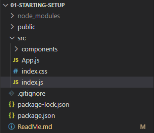
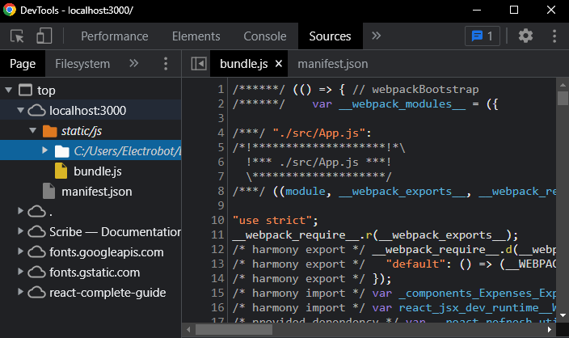
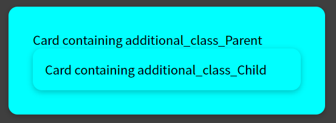

## What is React.js ?
- **A client-side JavaScript library**asdf

- **All about building modern, reactive user interfaces for the web**

- **Declarative, component-focused approach**

> HTML, CSS & JavaScript are about building user interfaces as well
  React makes building **complex**, **interactive** and **reactive** user interfaces **simpler**

https://github.com/academind/react-complete-guide-code/tree/01-getting-started/code/react-vs-vanilla-js-example

> React is all about **"Components"**

### Why Components ?
    Reusability - Don't repeat yourself
    Separation of Concerns - Don't do too many things in one and same place(function)
        -->Split big chunks of code into multiple smaller functions<--

### Declarative Approach
React allows you to create **re-usable and reactive components** consisting of **HTML and JavaScript** (and CSS).

    Define the desired target state(s) and let React figure out the actual JavaScript DOM instructions.

## Create React App
Install Node.js in your system (https://nodejs.org/en/download/).

```bash
npx create-react-app my-app
cd my-app
npm start
```
Reference: https://reactjs.org/docs/create-a-new-react-app.html#create-react-app

### Analyzing a Standard React Project

React is just a JavaScript code. React features + some special syntax introduced by React, it is all JavaScript.

<!--  -->


> First code file which will be executed is **index.js**

```jsx
// Content of index.js

import ReactDOM from 'react-dom/client';
import './index.css';
import App from './App';

const root = ReactDOM.createRoot(document.getElementById('root'));
root.render(<App />);
```

>Behind the scene this code will be transformed by some scripts when we start our react project.(npm start or react-scripts start).

ReactDom.createRoot() --> This creates the main entry point, the main hook of the overall user interface you are about to build with React.

> createRoot() tells React, where this React application,(this user interface which u build with React) should be placed in the web page that is loaded.

In **public** folder we have index.html file and that is the only html file this whole application has and will be loaded by browser. (SPA- single page application)

HTML file is entry point for the place where the React-driven user interface should be rendered. (div containing **id root**)

> root.render(<App />) is for replacing the content of **App function component** to that div containing id root.

App is something we are importing (w/o .js extension) from App.js.

```jsx
// Content of App.js

import Expenses from "./components/Expenses/Expenses";

const App = () => {
    return (
        <div>
            <h2> Let's get started! </h2>
        </div>
    );
}

export default App;
```
App is function that is returning **JSX** code.

## JSX (JavaScript XML)

We got HTML code in JavaScript !!

This will only work because there are transformation steps running behind the scenes of this process(npm start process). Transformed code can be seen in the **sources static/js** folder.

<!--  -->


This will not just include our source code (all functional component) but the entire React package code also (whole React library source code and the whole React Dom library source code).

> JSX is **not HTML** code but it is developer friendly version of the code that will transfer to browser friendly code.

JSX syntax includes all native HTML elements and there attributes. Attributes name are slightly changed. (eg **class** in HTML --> **className** in JSX)

JSX differs native element and custom component from react by checking case of the name.

**HTML elements** will always start with **lowercase** while **custom react** components must be in **Capitalize** format

### Writing complex JSX code

> You must only have one root element per JSX code snippet or per return statement

```jsx
// Example containing more than one root element in return statement which is not correct implementation.

import Expenses from "./components/Expenses/Expenses";

const App = () => {
return <div><h2>Let's get started!</h2></div><div>Description of the content</div>

}

export default App;
```

One solution is to wrap the code into another div.

```jsx
// Example containing correct implementation of JSX code snippet.

import Expenses from "./components/Expenses/Expenses";

const App = () => {
    return (
        <div>
            <div>
                <h2>Let's get started!</h2>
            </div>
            <div>
                Description of the content
            </div>
        <div>
    );
}

export default App;
```

### Why more than one root element is not allowed in return statement (or in JSX code snippet)?

JSX code is transformed in JavaScript code as shown below:
```jsx
// basic component containing JSX code

import Expenses from './Expenses';

function CompName() {
    const expenses = [{
        id: "e1",
        title: "Toilet Paper",
        amount: 94.12,
        date: new Date(2020, 7, 14),
    }];
    return (
        <div>
            <h2> Let's get Started! </h2>
            <Expenses items={expenses}>
        </div>
    );
}
```
>   Using React.createElement() we can create elements inside component, but it will be complex, hard to read for developers. 
```jsx    
// alternative of JSX code
function CompName() {
    
    ...

    return React.createElement('div', {}, 
        React.createElement('h2', {}, "Let's get Started!"),
        React.createElement(Expenses,{items: expenses})
    ) 
}
```
> React.createElement(ElementName, Attributes, ...content_inside_that_element)

In Javascript we can not return more than one thing, So there must be only one root element in JSX code. 

Reference: https://reactjs.org/docs/react-without-jsx.html

## Adding Basic CSS Styling

We can add css file by importing inside the react component.

```jsx
// importing css file 

import 'path/fileName.css';

function CompName() {
    ...
}
```
## Outputting dynamic data and working with expressions in JSX

We can write JavaScript logic before the return statement in react component.

To use the Variables/functions inside the JSX code, the JavaScript expression will wrap into the single opening and closing curly braces.

```jsx
// title variable is used inside JSX snippet using {}

function CompName() {
    const title = "Hello World !!";
    return (
        <div>
            {title} // "Hello World !!" will be rendered here.
        </div>
    );
}
```

## Passing data via **props**

If we want to pass data from parent component to child component we can do so using props.

It is nothing but a parameter of component function which is passed to child component.

props includes attributes (className, customAttributes) (and also functions)

```jsx
// App.js component passing custom attribute items to its child component Expenses

import Expenses from "./components/Expenses/Expenses";
import NewExpense from "./components/Expenses/NewExpense";

const App = () => {
const expenses = [
    {
        id: "e1",
        title: "Toilet Paper",
        amount: 94.12,
        date: new Date(2020, 7, 14),
    },
    {
        id: "e2",
        title: "Ice Cream",
        amount: 100.01,
        date: new Date(2020, 7, 15),
    },
];

return (
    <div>
        <h2>Let's get started!</h2>
        <Expenses items={expenses} />
    </div>
);
}

export default App;
```

> props makes components dynamic, we can reuse the same component with different data.

```jsx
// Expenses component gets the expenses (variable from App.js) data in props and again this data is passes to ExpenseItem component

import ExpenseItem from "./ExpenseItem";
const Expenses = (props) => {
return(
    <div className="expenses">
        <ExpenseItem
            title={props.items[0].title}
            amount={props.items[0].amount}
            date={props.items[0].date}
        />
        <ExpenseItem
            title={props.items[1].title}
            amount={props.items[1].amount}
            date={props.items[1].date} 
        />
    </div>
);
};

export default Expenses;
```

## Composition (children 'props')

> Approach of building a user interface from smaller building blocks is called composition.

Main Aspect of composition: what if we want to create a component which actually just serves as a shell around any kind of other content.

Generally we have components that are specific to one part(design) and through **passing data via props** we can fill that part dynamically.

We can pass components/HTML elements between opening and closing tags of a custom component.

### Example of Composition:
We want to create a common container structure for our React app that will render dynamic content (can be HTML elements or custom components) inside it.
Card container can have additional css applied along with default css.

Let's look at the solution :
> using props.children we can get content passed between component tags.

```css
/* css code for the Card */

.card {
    box-shadow: 0 2px 8px rgba(0, 0, 0, 0.25);
    border-radius: 12px;
    background-color: aqua;
}
```
```jsx
// Card component will act as container for content inside it.

import './Card.css'; // importing above css code

const Card = (props) => {
    return ( // below div contains additional classes that are passed in props along with 'card' class
        <div className={'card ' + props.className}>
            {props.children}
        </div>
    );
}

export default Card;
```

```css
/* css code for additional classes */

.additional_class_parent {
  padding: 2rem;
}

.additional_class_child {
  padding: 1rem;
}
```

```jsx
// Example showing Card container in use

import Card from 'some_path/Card.js';

const SampleComp = () => {
    return (
        <Card className="additional_class_parent">
            <span>Card containing additional_class_Parent</span>

            <Card className="additional_class_child">
                <span>Card containing additional_class_Child</span>
            </Card>
        </Card>
    )
}
```
**Output :** 

<!--   -->


