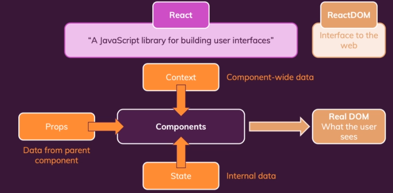
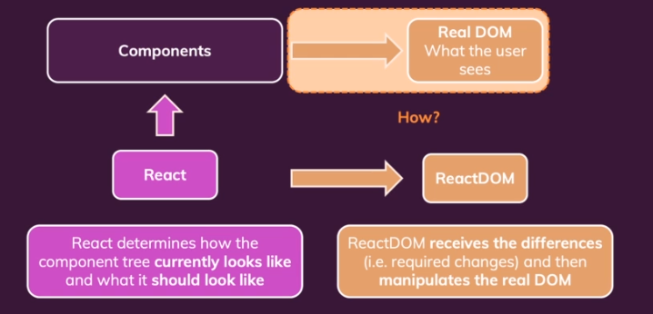
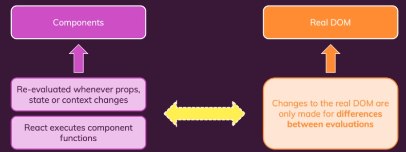
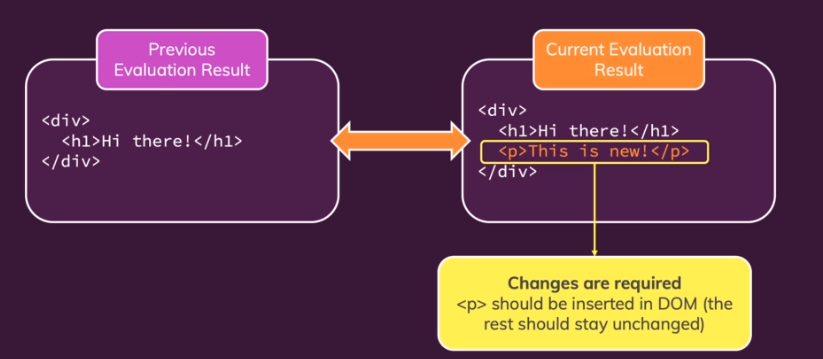

How does React Work Behind the Scenes
Understanding the Virtual DOM & DOM Updates
Understanding States & State Update

# How React Works

React - does not not the web. does not know about html elements. (does know how to work with components and states)
React DOM - is interface to the web to bring the real html elements to the screen.

React will provide information about the differences from previous virtual DOM. Then React DOM changes only the necessary elements in real DOM. (rest elements will remain unchanged)

> Re-Evaluating !== Re-Rendering the DOM
>> just because a component is re-evaluated by react does not mean that the respective part of the actual real DOM is re-evaluated

> This is because for every small changes if we are to update the real DOM then the performance will be slow.

## Example

