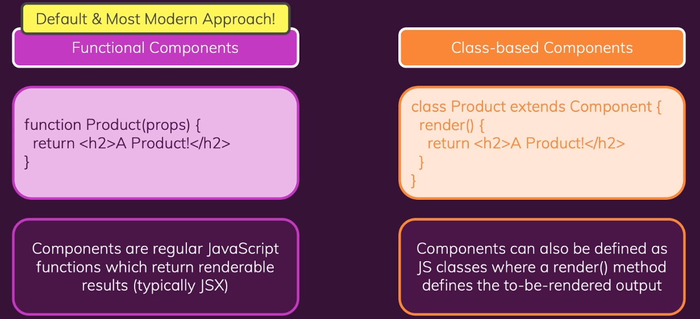

# Class based Components: An alternative to Functions

We can define a component by creating a class.

Traditionally (React < 16.8) you had to use class based components to manage "State".
React 16.8 introduced **React Hooks** for Functional components.

> Class based component **can't use** React Hooks !
