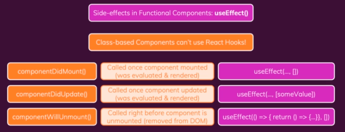

# Class based Components: An alternative to Functions

We can define a component by creating a class.


Traditionally (React < 16.8) you had to use class based components to manage "State".
React 16.8 introduced **React Hooks** for Functional components.

> Class based component **can't use** React Hooks !

## Transforming function component to class-based component

```jsx
// component function User

import styles from './User.module.css';

export const User = (props) => {
    return <li className={styles.user}>{props.name}</li>
}
```
We will import **Component** from 'react' library and through that we can access props in class based component by adding this.

```jsx
// conversion of User component

import {component} from 'react';
import styles from './User.module.css';

export class User extends Component {
    render() {
        return <li className={styles.user}>{this.props.name}</li>
    }
}
```

> We can use both functional component and class based component in one project but, in practice usually either of them are used to build a project. 

# Working with State & Events

We will convert [this](https://codesandbox.io/s/class-based-components-594pki?file=/src/components/Users.js) Users functional based component to class based component.

```jsx
import { Component } from "react";
import User from "./User";

import classes from "./Users.module.css";

const DUMMY_USERS = [
  { id: "u1", name: "Max" },
  { id: "u2", name: "Manuel" },
  { id: "u3", name: "Julie" }
];

class Users extends Component {
  constructor() {
    super();
    this.state = { showUsers: true, dummyState: "dummyState" }; // (1)
  }

  toggleUsersHandler() {
    this.setState((curState) => { // (2)
      alert(JSON.stringify(curState));
      return { showUsers: !curState.showUsers };
    });
  }

  render() {
    const usersList = (
      <ul>
        {DUMMY_USERS.map((user) => (
          <User key={user.id} name={user.name} />
        ))}
      </ul>
    );
    return (
      <div className={classes.users}>
        <button onClick={this.toggleUsersHandler.bind(this)}> // (3)
          {this.state.showUsers ? "Hide" : "Show"} Users
        </button>
        {this.state.showUsers && usersList}
      </div>
    );
  }
}

export default Users;

```

> at line (1), we are initializing the state of class, **in class based component state must be object only**

> at line (2), we are updating state using setState method, the previous value of state can be fetched by passing a function in the setState method. We need to **return only the updated value/s in setState().** The **updated value will be merged with the existing state value.**

> at line (3), We have to use bind() that will set the context for the toggleUsersHandler method and will return new function. For more details on bind, see [here](https://academind.com/tutorials/this-keyword-function-references/)

# Class-based Component Lifecycle

We can not use any hooks in classed based components, but using lifecycle methods we can achieve the same functionality as hooks.



## Example

### componentDidUpdated
### componentDidMount
### componentWillUnMount

### componentDidCatch (error boundary)
