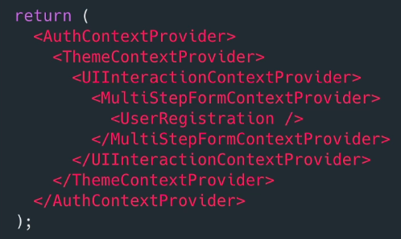
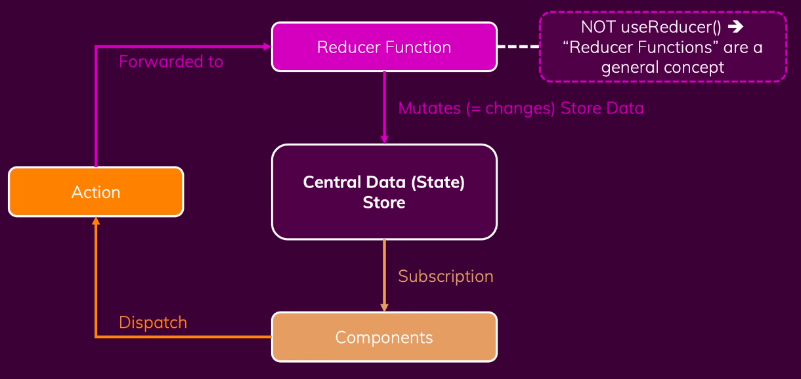

# What is Redux ?
A state management system for cross-component or app-wide state.

## Three types of states 

1. local state
- State that belongs to a single component.
- Should be managed component internal with useState() / useReducer()

2. Cross-Component state
- State that affects multiple components.
- Eg. open/closed state of modal overlay
- Requires props chains / props drilling

3. App-Wide state
- State that affects the entire app (most/ all components)
- Eg. user authentication status
- Requires props chains/ props drilling

> For 2 & 3 we can use **useContext or Redux** to manage the state

## Redux vs React Context

### React-Context Potential Disadvantages
1. Complex Setup / Management (depends on the application size)
eg. lot of different context provider components.

2. Performance
React context is not optimized for high frequency state changes.

# Core Redux concepts

One Central Data (State) store for whole application.

;