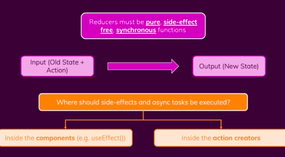
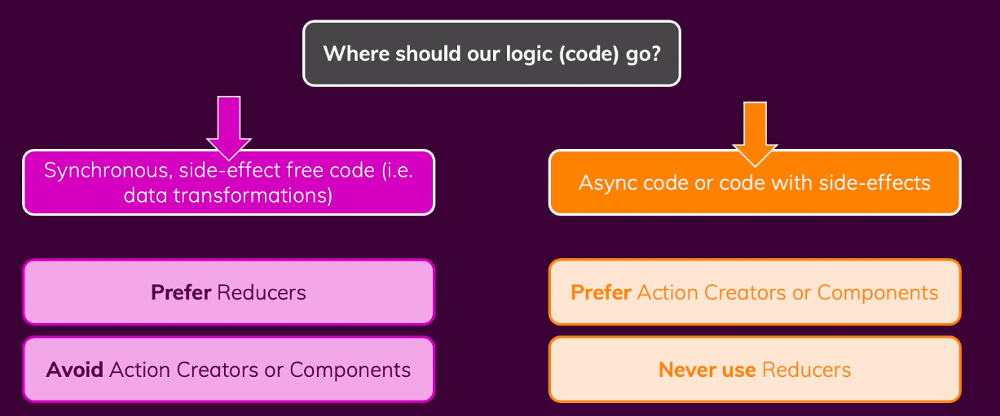

# Side Effects, Async tasks & Redux



project w/o having any async code: [here](https://github.com/Nishith1998/OnlineShopping/tree/without-async-logic)

Where to put logic:
;

1. inside component (using useEffects)

Example project: with useEFfect method [here](https://github.com/Nishith1998/OnlineShopping/tree/1.-handling-async-code-with-useEffect)

We can use useEffect for calling the API, suppose we need to call an API when adding to cart button is clicked. At that time state in redux will also change. So we can implement API call in useEFfect like this: 
```jsx
export const () => {
    let appInitialized = true; // flag for preventing API call when App loads
    const dispatch = useDispatch();
    const cart = useSelector((state: GlobalState) => state.cart); // subscribing the cart state

  useEffect(() => {
    if (appInitialized) { // to prevent to call when first time component is executing
      appInitialized = false;
      return;
    }
    async function addToCartAPI() {

      const response = await fetch(
        "https://real-time-emp-8518f-default-rtdb.firebaseio.com/cart.json",
        {
          method: "PUT",
          body: JSON.stringify(cart),
        }
      );
      if (!response.ok) {
        throw new Error("response not ok");
      }

    //   dispatch(
    //     UIActions.setNotification({
    //       status: "success",
    //       title: "Added to cart",
    //       message: "success",
    //     })
    //   );
    }

    addToCartAPI().catch(() => {
      dispatch(
        UIActions.setNotification({
          status: "error",
          title: "adding cart failed",
          message: "error",
        })
      );
    });
  }, [cart]); // whenever cart state changes useEffect function will be executed
  ...
}
```

2. Action creator (Thunk)

A Thunk is a function that delays an action until later.

By using thunk we can move the async code out of the component and put it in one action. That action after getting response will execute another actions to update the state.

Creator action functions will return a function, that function contains dispatch as argument, and in that function body we can write our API calling logic.

Let's create a function inside cart-slice.js file.

```jsx
// cart-slice.tsx

export const sendCartData = (cart: CartState) => {
  return async (dispatch: Dispatch) => {
    dispatch(
      UIActions.setNotification({
        status: "pending",
        title: "Adding to cart",
        message: "pending",
      })
    );
    async function addToCartApi() {
      const response = await fetch(
        "https://real-time-emp-8518f-default-rtdb.firebaseio.com/cart.json",
        {
          method: "PUT",
          body: JSON.stringify(cart),
        }
      );
      if (!response.ok) {
        throw new Error("response not ok");
      }
    }

    try {
      await addToCartApi();
      dispatch(
        UIActions.setNotification({
          status: "success",
          title: "Added to cart",
          message: "success",
        })
      );
    } catch {
      dispatch(
        UIActions.setNotification({
          status: "error",
          title: "Failed to add",
          message: "error",
        })
      );
    }
  };
};
```

Now We can dispatch this creator function from our components.

```jsx
// component dispatching the creator action

  let appInitialized = true;

  function App() {
    ...
    useEffect(() => {
      if (appInitialized) {
        appInitialized = false;
        return;
      }
      dispatch(sendCartData(cart)); // dispatching creator action function
    }, [cart, dispatch]);
    return (
      <Layout>
        {showCart && <Cart />}
        <Products />
      </Layout>
    );
  }

  export default App;

```