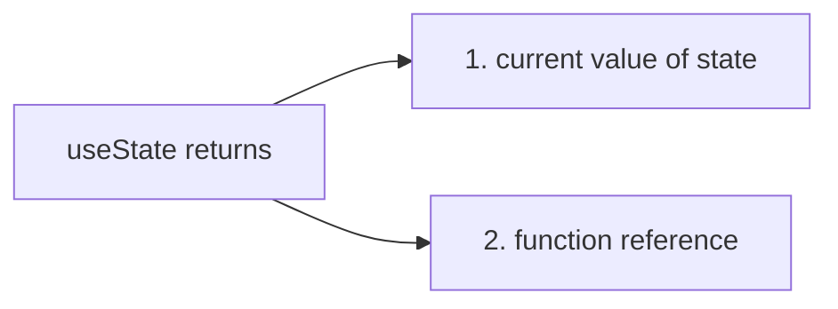

User Interaction & State
Making Apps Interactive & Reactive


#  Listening to Events & Working with EventHandlers

In all built in HTML elements (such as div, h2, button), we have full access to native DOM events which we can listen to. (eg. click, blur, ...)

Reference: https://developer.mozilla.org/en-US/docs/Web/API/Element#events

> For all these default events there is prop equivalent in React which we can add to these built-in HTML elements to listen to these events

With JavaScript we add event listener like this :
```js
// imperative way to add event listener

document.getElementById('some_id').addEventListener();
```

>React expose all these default events as props which start with **on** word.

> All these props(starting with on), want a function as value and that function will execute when that event occurs.

```jsx
// adding events: functionRef will be executed when button is clicked

const SomeComp = () => {
    let title = 'Reacting to Events';
    const clickHandler = (event) => {
        console.log("event:", event);
    }
    return (
        <div>{title}</div>
        <button onClick={clickHandler}> Click Me </button>
    );
}
```
> We attached only reference of function (clickHandler without () in button prop onClick value) to onClick event. If we put function call there to prop value that function will be executed on page load also.


# How Component Functions Are Executed

After reacting to event now question arise, How can we now change what shows up on the screen.

suppose we want to change the title on click of a button.

Intuition : *we should change the value of title variable inside clickHandler function.*

```jsx
// React does not work like this...
// Wrong code of updating variable's value in the view

const SomeComp = () => {
    let title = 'Reacting to Events';
    const clickHandler = (event) => {
        console.log("event:", event);
        title = "updated!!"; // title variable value is changed, still this will not reflect in the view
    }
    return (
        <div>{title}</div>
        <button onClick={clickHandler}> Click Me </button>
    );
}
```
Though function will execute on click and if we put log for the variable value it will be updated value only, we will not see updated value in view.

Our React Component is function (**that returns JSX**), we have never called any component functions and we just use this functions like HTML elements in JSX code.

By using our components in JSX code, we make react aware of our component functions and whenever react evaluates this JSX code, it will call these component functions. (*and this functions also return some more JSX code(of its child components), this happens until there is no more JSX code to be evaluated*)

Its all started by the [index.js](./1.%20React%20Basics%20%26%20Working%20with%20Components.md#analyzing-a-standard-react-project) file where we initially point at App component.

Problem is React will go through this component functions only when the application is initially rendered, So we need a way to call a component function to change the values in the view.


# Working with "State"

## useState
useState is function (also **React hook**) from react library and it allow us to **define values as state** where changes to these values should reflect in the component function being called again.

> All the hooks in React start with **use** word, And they must be called inside of React component functions. (they can't be called outside of the React functions and also should not be called in any nested functions(for nested function there is one exception))

### How to use useState function
Inside of the component function we just need to call useState();
useState() creates a special kind of variable where changes will lead component functions to be called again. we can initialize the state value by passing value into useState(value) function. 

To use the variable, useState() return the value of the current state along with one function (which passes as value), the function is used to modify the value of the variable(state value).


```jsx
// Example of State

import { useState } from react;

const SomeComp = () => {
    
    const [title, setTitle] useState('Reacting to Events'); // using array destructuring we define const title variable and setTitle function

    const clickHandler = (event) => {
        console.log("event:", event);
        setTitle('updated!!'); // This function updates the current state value and 
        //it is responsible for calling the current component function (SomeComp) again to rerender.
    }
    return (
        <div>{title}</div>
        <button onClick={clickHandler}> Click Me </button>
    );
}

```



> **Note:**<br>
    if we log the value of title inside clickHandler, we will get old value only because calling the state-updating function actually **doesn't change the value right away** but instead **schedule the state update.** so the updated value may not available yet in clickHandler. But in the view eventually we will see the updated value.


If we have multiple instance of function components (eg. ```<SomeComp />``` is used more than places), on Click, only that instance which is being clicked, will be called again (to rerender).

>  When the component function is executed second time, it will update the function **const variable title** (we will never reassign value to this variable, only through setTitle the value will be updated).`

That **does not mean** second time we will **override the const title** with 'Reacting to Events'<br>
>    React keeps track of when we call useState in a given component instance for the first time and when we call it for the first time ever, it will take that argument as an initial value but if a component is then re-executed because of a state change, React will not reinitialize the state instead it will detect that this State had been initialized in the past and it will just grab latest State and return that State value.


