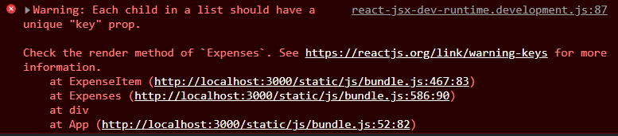

Outputting Dynamic Lists of Content and Rendering Content Under Certain Conditions

# Rendering Lists of Data

> If we have list of Component elements inside JSX code. All the components will be rendered one after another.

```jsx
// Rendering list of (JSX)elements

const SomeComp = () => {
    return (
        {[<CustomComp1 />, <CustomComp2 />]} {/* this custom components will be rendered in the view side by side */}
    );
}
```

So in JSX code, somehow we need to end up with list (dynamic) of JSX elements. We can do that by using map.

```jsx
// Dynamically render the list of (JSX)elements.

const SomeComp = () => {
    const listOfItems = [{name: 'asdf1', id: 1}, {name: 'asdf2', id: 2}];

    return (
        {listOfItems.map(item => <CustomComp nameInfo={item} />)} {/* map() will return new list of CustomCop with dynamic data */} 
    )
}
```

# Understanding Keys

We will get **key warning** whenever we use stateful lists (add new item to list from UI (form inputs) and show the list in UI).



React has one concept to ensure updating and rerendering such lists efficiently without performance losses or bugs.

Currently (without keys), if we add item to list, React renders this new item as the last item in this list of div's and updates all items and replace their content such that it again matches the order of the items in Array.

> Without keys, All items are visited and updated, leads to bug when item is stateful.

We have a way of telling react where new item should we added in view. We add a special prop **key** and add some unique value to it to identify individual items.

```jsx
// Example of Keys.

const SomeComp = () => {
    const [listOfItems, setListOfItems] = useState([{name: 'asdf1', id: 1}, {name: 'asdf2', id: 2}]);
    
    const clickHandler = () => {
        setListOfItems(pervState => [...prevState, {name: 'asdf3', id: 3}]);
    }

    return (
        {listOfItems.map(item => <CustomComp key={item.id} nameInfo={item} />)} {/* map() will return new list of CustomCop with dynamic data */} 

        <button onClick={clickHandler}>click to add item</button>
    )
}
```

> we should always map a key when mapping out lists of items.

# Outputting Conditional Content

long statements such as for, if are not allowed between the curly braces.

We can use ternary operator to render conditions.

```jsx
// Example of ternary operator

import { useState } from 'react';

const SomeComp = () => {
    const [flag, setFlag] = useState(true);
    const clickHandler = () => {
        setFlag(prevState => !prevState);
    }
    return (
        <div>
        {flag ? <span>Flag value is true</span> : <span>Flag value is false</span>}
        <button onClick={clickHandler}>Toggle Flag</button>
        </div>
    )
}
```

## Abuse a little trick for && operator in JS
  JavaScript works such that if you use the && operator, it basically will return the part after the && operator(as result of overall check) only if first condition is true.

  As an example for statement 1 === 1 && 2 wil return 2.

## Assign JSX code to a variable

```jsx
import { useState } from 'react';

const SomeComp = () => {
    const [flag, setFlag] = useState(true);

    let flagContent = <span>Flag value is true</span>;

    const clickHandler = () => {
        setFlag(prevState => !prevState);
    }

    if(!flag)
        flagContent = <span>Flag value is false</span>;

    return(
        <div>
            {flagContent}
            <button onClick={clickHandler}>Toggle Flag</button>
        </div>
    )
}
```
