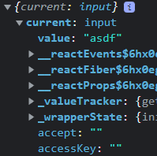

JSX limitations & fragments - Getting a Cleaner DOM with Portals - Working with Refs

# JSX Limitations & Workarounds

1. Only one root element allowed
Solution:
1. Wrap siblings around a div - problem with that is we may have unnecessary multiple div (called "```<div>``` soup") to render, lower performance

2. Use List - Example shown in below code snippet - problem with that is we have to define key to each element in the list

```jsx
// Example code of using list alternative of wrapping more than one element around div
const SomeComp = () => {
    return(
        [
            <h1 key="SomeH1">header</h1>,
            <div key="SomeContent">content</div>
        ]
    );
}
```

# Creating a Wrapper component

We can do little trick to solve above problem by building custom wrapper component.
```jsx
// Wrapper component return only children
const Wrapper = props => {
    return props.children;
}
```

```jsx
const SomeComp = () => {
    return(
        <Wrapper>
        <h1>header</h1>
        <div>content</div>
        </Wrapper>
    );
}
```

# React Fragments

React provides wrapper component that can be used to wrap sibling elements/components.

> Empty wrapper component. it doesn't render any real HTML elements to the DOM. But it fulfills React's JSX's requirement.

```jsx
import React from 'react';

const SomeComp = () => {
    return(
        <React.Fragment>
        <h1>header</h1>
        <div>content</div>
        </React.Fragment>
    );
}
```
```jsx
const SomeComp = () => {
    return(
        <React.Fragment>
        <h1>header</h1>
        <div>content</div>
        </React.Fragment>
    );
}
```
Another way to use Fragments but for this your project must be configured.
```jsx
const SomeComp = () => {
    return(
        <>
        <h1>header</h1>
        <div>content</div>
        </>
    );
}
```

# React Portals

Nested modal,dialog,drawers,... content isn't ideal because it is an **overlay for the entire page**.

Because of the applied css we can hide it from the view but still the html will be read by interpreter.

We can use the portal to keep the structure of React source code (write modal(overlay) component at same place), and still render the code differently in Real DOM. (render in Real DOM somewhere else)

Portal needs two things
1. the place u want to port the component to
2. let the component know it should portal to the place

```jsx
// index.html create portal
<body>
    <div id="overlay-root"></div>
    <div id="root"></div>
<body>
```
```jsx
// Example of using Portal

import ReactDom from 'react-dom';

const SomeComp = () => {
    
    return(
        {ReactDom.createPortal(<Dialog />, document.getElementById('overlay-root'))}
    );
}
```

# Working with Refs

Allow us to get access to other DOM elements and work with them.

We can retrieve actual DOM element that is rendered from ref. Though we can manipulate DOM after retrieving we should not use refs to manipulate DOM. Refs can be used to read the values or other properties of elements.

**ref** is special prop in React, we assign variable (returned value of useRef() hook) to it to make connection between the element and the variable.

```jsx
import { useRef } from 'react';

const SomeComp = () => {
    const userInput = useRef();
    const submitHandler = () => {
        console.log("Input Value by Ref: ", userInput.current.value);
    }

    return(
        <form onSubmit={submitHandler}>
            <input ref={userInput} type="text">
            <button type="submit">
        </form>
    );
}
```

if we console ref value:



