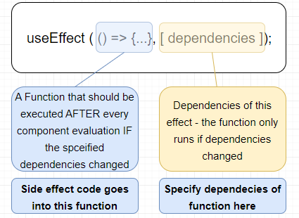

Working with (Side) Effects - Managing more Complex State with Reducers - Managing App-Wide or Component-Wide State with Context

# What is an "Effect" (or a "Side Effect")?
The component function is re-executed whenever some state changes and then react checks the new results (new JSX code) and compare with previous result, changes should go to real DOM.

| Rendering the view & reacting to user events (and re-render)  | Additional logic not directly related to rendering |
|---|---|
| Main Job: Render UI & React to User Input  Evaluate & Render JSX Manage State & Props React to (User) Events & Input Re-evaluate Component upon State & Prop Changes  This all is "backed into" React via the "tools" and features (i.e. useState() Hook, Props etc). | Side Effects: Anything Else  Store Data in Browser Storage  Send Http Requests to Backend Servers Set & Manage Timers  These tasks **must happen outside of the normal component evaluation** and render cycle - especially since they might block/delay rendering. (e.g. Http requests)|

If we want to send API request from our component and whenever component function re-runs then inside state we will make an api call. Now when response of the api comes again we will change the state to re-render the component function. This can be lead in infinite loop and that's why such side effects should not go directly inside component function.

# useEffect

React hook lets you perform side effects in function components.

